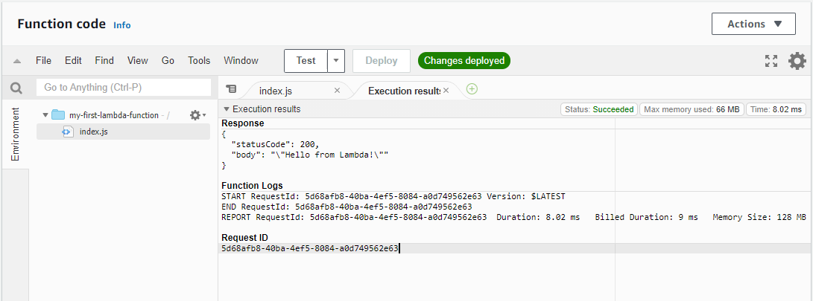

# Getting Started with Lambda

Doc.: https://docs.aws.amazon.com/lambda/latest/dg/getting-started.html

- Usar AWS Management Console para criar função lambda;
- Em poucos minutos, criar uma função, invocá-la, vier seus logs, métricas
e trace data;

## 1. Criando Conta na AWS

Doc.: https://aws.amazon.com/premiumsupport/knowledge-center/create-and-activate-aws-account/

- Visite https://aws.amazon.com/
- Caso não tenha conta, fazer em https://portal.aws.amazon.com/billing/signup#/start
  - Criar a conta
  - Adicionar método de pagamento (cartão internacional)
  - Verificação de número de telefone
  - Esperar pela ativação da conta
- Tendo em vista dificuldades para criar a conta, eu planejo fornecer um usuário logável
para cada mentorado (com username e senha, podendo logar no AWS Management Console);

## 2. Explicação sobre Criação das Funções Lambda

- Podemos criar usando Toolkit de IDE, AWSCLI ou AWS SDK;
- Lambda Console fornece um editor de código para linguagens não-compiladas, permitindo
modificar e testar código rapidamente;
- Avançado: AWSCLI permite acessar a API Lambda diretamente para configurações avançadas e automação

## 3. O que é uma Função Lambda? Do que exatamente é feito?

- É uma porção de código de alguma linguagem de programação;
- Algumas LPs tem o conceito de função lambda, mas é uma referência a programação funcional;
- Função Lambda na AWS é apenas uma referência "nostálgica", mas é mais simples ainda: o código
mais importante é a função e o que ele faz. Não precisa se importar em configurar o ambiente
porque a AWS já faz;
- A função lambda é feita apenas de um pacote que tem o seu código, seja em Javascript, Python, Java, ...

## 4. Como fazer a função lambda rodar na AWS?

- Existem 2 formas: 
  - Através de um arquivo .zip contendo seu código e dependências caso seja necessário;
  - [AVANÇADO] através de um container image que precisa seguir padrão da OCI

## Criação da Função Lambda

- Vamos criar uma Função Lambda que roda um código em NodeJS 14

### Via Console

1. Abra a página do [AWS Lambda Functions](https://console.aws.amazon.com/lambda/home#/functions)
2. Clique em "Create function"
3. Temos 4 opções de criação de função:
   - Author from Scratch: código Javascript simples com um "Hello, World!"
   - Blueprint: código Javascript de exemplos mais elaborados e próximos da vida real
   - Container Image: código que está dentro de uma imagem do Docker
   - Serverless App Repository: uso do AWS SAM para criar projetos serverless mais complexos
   - **SELECIONE 'Author from scratch'**
4. Em Basic Information, preencha assim:
   - Function name: `my-first-lambda-function`
   - Runtime: `Node.js 14.x`
   - Permissions: não precisa alterar, a AWS irá criar para você
5. Clique em Create function

> COMENTÁRIOS: A gente aqui está criando um código JS para NodeJS e uma
**execution role** que fornece as permissões necessárias para fazer logs.
O que é execution role? É uma permissão que permite sua
função lambda conseguir registrar logs (relatórios do que aconteceu com 
seu código e o ambiente), para ser invocada (isto é, executada) e para criar
credenciais para o AWS SDK e ler dados de origem de eventos

## Visão Geral sobre a Função Lambda

1. Observe o Diagrama ou se atente a explicação da sua descrição
. Temos aqui na figura
central um ícone e ao lado o texto "my-first-lambda-function". É o nome
da nossa função lambda criada. Abaixo da figura, existe uma outra representando
o conjunto de Layers utilizados. Futuramente será explicado o conceito de Layers.
Estamos usando nenhum Layer.

2. À esquerda, temos um botão chamado "Add Trigger". Chamamos esse lado de 
upstream porque ele serve como uma espécie de entrada de dados, disparando
a função lambda a medida que ocorre algum evento associado como envio de email.
Ou seja, podemos aqui dizer para função lambda ser executada quando acontecer
coisas do tipo criação de banco de dados, ordem de pagamento, início da corrida de
aplicativo e até mesmo uma outra função lambda executada;

3. À direita, temos um botão chamado "Add destination". Chamamos esse lado de
downstream porque ele serve como uma espécie de saída de dados. Após a execução 
da função lambda, podemos fazer pedido de criação de registro num banco de dados,
executar outra função lambda, enviar um email e etc;

## Invocar a Função Lambda

Invocar a função lambda significa executar. É a mesma coisa.

1. Nessa tela, temos um editor de código da nossa função lambda.
. Temos aqui o código
em Javascript compatível num arquivo chamado `index.js` com ambiente do NodeJS.

2. Vamos invocar nossa função? Ao lado do Menu Window existe um botão chamado
Test. Clique nele. A janela Test Event é aberta para criarmos um Evento de Teste.

3. Existe um radio button marcando "Create new test event" sinalizando
que iremos criar um Evento de Teste. Abaixo, existe o Event Template, que são
modelos de eventos para testarmos. Certifique-se que esteja selecionado "Hello, World". 
Cada usuário pode criar até 10 eventos de teste/função. Esses eventos de teste ficam
só para você, nenhum outro usuário tem acesso.

4. Coloque o Event name como "test1". 

5. Existe o seguinte modelo de evento já inserido:

```json
{
    "key1": "value1",
    "key2": "value2",
    "key3": "value3"
}
```

6. O modelo de evento é a entrada de dados para a função lambda.
É um código de texto em JSON. 

7. Clique em Create Event para criar o evento de teste. Em seguida,
clique novamente no botão Test para Invocar a sua função lambda.

8. Agora teremos algo como a figura . 
Temos aqui o resultado da execução da função lambda. Várias informações, 
como a resposta que o nosso código deu, o log da função dizendo
o quanto de memória RAM consumiu, o tempo que ela demorou pra executar, o tempo cobrado
(acontece um arredondamento onde a AWS aplica algumas regras de custo). Temos também a Request ID, 
a identificação da requisição feita, sendo um código de identificação único global.

9. Seu código na função "handler" no arquivo index.js recebe a entrada de dados do evento de teste,
processa e dá uma resposta.

10. Quando o código é bem executado, ele responde com o Status de Sucesso. Observe também
que a AWS nos informa o consumo máximo de memória usada (cerca de 66 MB). Isso quer dizer
que o NodeJS e o nosso código gastaram juntos cerca de 66 MB num pico de uso enquanto
executavam o código. Há outro indicador como o memory size, indicando a memória RAM que alocamos
para a função lambda. Temos liberdade de dizer o quanto de memória queremos. Por padrão,
a AWS sempre deixa 128 MB de início, podendo a gente aumentar esse valor.

## Introdução ao Monitoramento

1. Execute o teste da sua função lambda pelo menos 5 vezes, sendo 1 vez a cada 10 segundos mais ou menos.
Na figura , temos a visualização de gráficos
com as métricas que o AWS Lambda envia para um serviço chamado CloudWatch. O CloudWatch atua como
um coletor de medições que podemos consultar num certo período de tempo. Dependendo da filtragem
da janela de tempo dos dados das métricas e latência do CloudWatch para nos mostrar os dados mais recentes
acabamos as vezes por esperar alguns segundos para os gráficos serem atualizados corretamente.

## Acabando o trabalho, quer limpar toda a sujeira?

1. No término do trabalho, é útil remover função lambda que não será mais utilizada e seus recursos associados.

2. Para excluir sua função lambda, clique em Actions > Delete function. Aparece a janela de confirmação,
confirme com Delete novamente. Só isso? Não...Há alumas outras sujeiras.

3. Excluir os logs de monitoramento, entre no link [AWS CloudWatch | log groups](https://console.aws.amazon.com/cloudwatch/home?region=us-east-1#logsV2:log-groups). Temos aqui uma lista de log groups. Um log group é um grupo
lógico que organizamos os relatórios (logs). Por que fazer logs é importante? Em se tratando de Cloud,
grande maioria das vezes não conseguimos acessar diretamente os serviços, como acontece com AWS Lambda,
por que não existe Máquina Virtual acessível por SSH.

4. Selecione o grupo "/aws/lambda/my-first-lambda-function". Vá em Actions > Delete log group(s). Em seguida,
confirme com Delete.

5. Falta algo mais? Sim, temos que excluir o execution role.

6. Visite https://console.aws.amazon.com/iam/home?#/roles. Existe uma barra de pesquisa, digite
"my-first-lambda-function". Vai aparecer algo assim .
Certifique que a role esteja selecionada e clique em "Delete role". Em seguida confirme novamente
com "Yes, delete".

> COMENTÁRIOS: É possível automatizar a criação e limpeza de funções, roles e logs com AWSCLI e AWS Cloudformation
num contexto de automação mais avançada.


IDEIA
Ruby: list_emails.scan(/^(\w+)\s*\:\s*(\S+)/) do |field, value| print field; puts value end
Js: 

const regexp = /(\w+)\: (\S+)/g;
const str = "nome: Cristian\nemail: cristianc.mello@gmail.com";

const matches = str.matchAll(regexp);

for (const match of matches) {
  let field = match[1];
  let value = match[2];
  
  console.log(field, value)
}